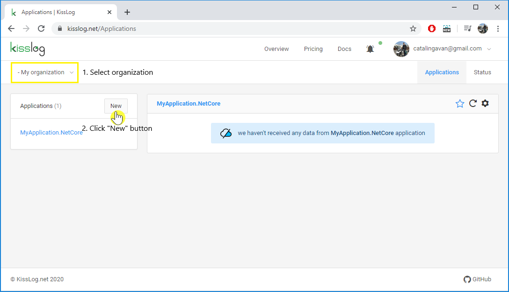
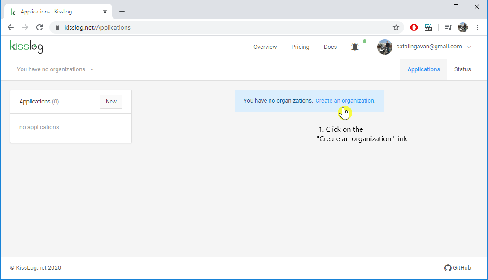
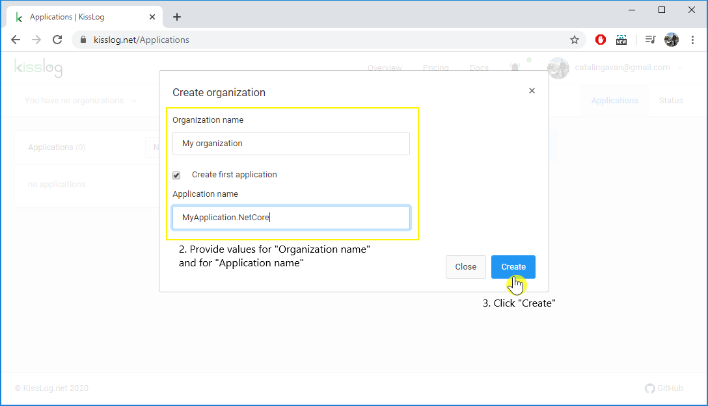

Create application
============================

.. contents::
   :local:
   :depth: 1

Add to existing organization
-----------------------------------

#. Navigate to ``/Applications`` url

#. **Select the organization** from the top left dropdown menu

#. On the Applications menu, click on the **New** button

#. Provide value for **Application name**

#. Click **Create**

.. figure:: images/existing-organization-2.png
   :alt: Create application modal
   :align: center

No existing organization
-----------------------------------

#. Navigate to ``/Applications`` url

#. Click on the **Create an organization** link

#. Provide values for **Organization name** and for **Application name**

#. Click **Create**

